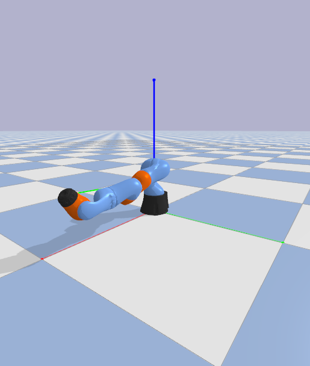

#  PyBullet Arm PPO Agent

Нейросетевой агент, обучающий роботизированную руку (KUKA iiwa) достигать целей в 2D-пространстве с помощью Reinforcement Learning (алгоритм PPO). Управление реализовано в симуляторе PyBullet.



##  Состав проекта

- **`train_arm.py`** — обучение модели на кастомной среде `SimpleArmEnv`, построенной на Gymnasium + PyBullet.
- **`test_arm.py`** — визуализация поведения обученной модели в среде `TestArmEnv` с графическим интерфейсом.
- **`continue_training.py`** — дообучение уже обученной модели с сохранением прогресса.

##  Особенности среды

- Управление двумя суставами манипулятора (Joints 0 и 3)
- Награда (reward) основана на расстоянии до цели: shaping + бонус за достижение
- Реализация через OpenAI Gym API: `step()`, `reset()`, `observation_space`

##  Установка

Установите зависимости:

```bash
pip install -r requirements.txt

 Запуск обучения

python train_arm.py

👁 Запуск визуализации

python test_arm.py


Screenshot GUI
 Технологии

    Python
    PyBullet
    Gymnasium
    Stable-Baselines3 (PPO)
